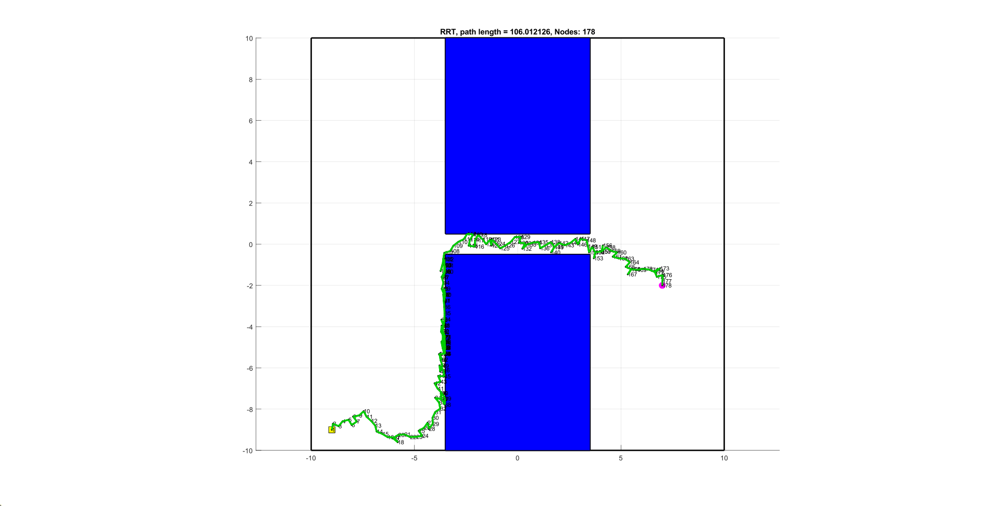
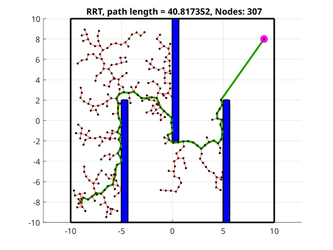
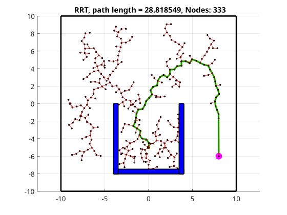
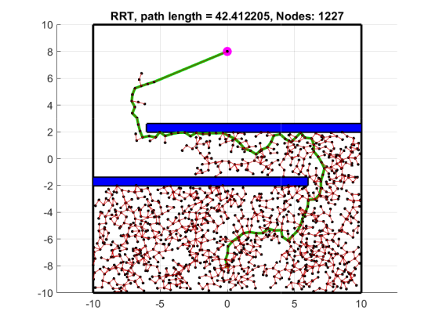
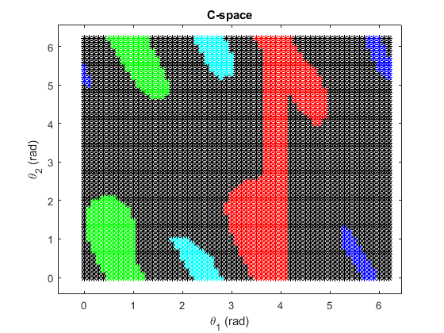
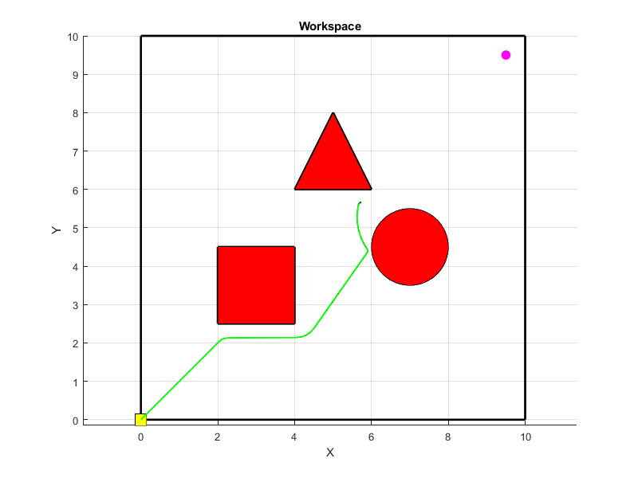

# Robot Motion Planning in MATLAB

MATLAB implementations of three foundational robot-motion-planning problems: configuration-space construction for a planar manipulator, artificial potential-field guidance, and object-oriented Rapidly-exploring Random Tree (RRT) planning.

The code was developed in 2022 while auditing ME766A at IIT Kanpur. The RRT planner is the central component of the repository.

## Object-oriented RRT path planning

The RRT implementation models the planner and its geometry using MATLAB classes for the tree, nodes, edges, workspace boundaries, obstacle fields, and line-segment intersection tests.



The planner supports:

- uniform and goal-biased configuration sampling;
- inverse-CDF sampling around the goal;
- fixed-step tree extension;
- direct growth toward the goal;
- grow-and-connect and shoot-and-connect strategies;
- collision checks against circles, rectangles, triangles, and workspace boundaries;
- edge-intersection and discretized edge-collision checks;
- parent-linked path reconstruction;
- path-length and node-count reporting;
- optional tree animation and node labels; and
- multiple obstacle environments, including blocks, walls, narrow passages, and mixed shapes.

The separate development copies used while building the RRT class are intentionally omitted. Their useful capabilities are already incorporated and extended in `rrt-path-planning/rrt.m`.

### Additional challenge environments

Three new environments extend the original scenario collection:

- **Alternating-wall slalom:** three offset gates require repeated changes in travel direction.
- **U-shaped cul-de-sac:** the start lies inside a pocket while the goal is outside and behind a wall, forcing exploration away from the tempting direct route.
- **S-corridor:** two offset walls require the tree to find openings on opposite sides of the workspace.

| Alternating-wall slalom | U-shaped cul-de-sac | S-corridor |
| --- | --- | --- |
|  |  |  |

## Included studies

### 1. Planar manipulator configuration space

`manipulator-configuration-space/` samples the two joint angles of a planar 2R arm and classifies configurations by collision with rectangular, circular, and triangular obstacles. It visualizes both the Cartesian obstacle field and the corresponding occupied/free configuration space.



Run:

```matlab
cd('manipulator-configuration-space')
generate_configuration_space
```

### 2. Artificial potential-field guidance

`artificial-potential-fields/` guides a point robot using the sum of an attractive goal field and repulsive obstacle fields. The scripts compare attractive and repulsive gain choices, plot the potential/gradient field, and demonstrate detection of a local minimum.



Run one of:

```matlab
cd('artificial-potential-fields')
compare_attractive_gain
compare_repulsive_gain
local_minimum_demo
```

### 3. Rapidly-exploring Random Trees

`rrt-path-planning/` contains the reusable object-oriented RRT implementation and four scenario scripts:

```matlab
cd('rrt-path-planning')
demo_mixed_obstacles
demo_four_blocks
demo_wall_environment
demo_narrow_corridor
demo_slalom_corridor
demo_u_trap
demo_s_corridor
```

RRT construction is stochastic, so the generated tree, node count, path, and path length vary between runs.

## Repository structure

```text
robot-motion-planning-matlab/
|-- manipulator-configuration-space/
|   |-- generate_configuration_space.m
|   |-- TwoR.m
|   |-- Obstacle.m
|   `-- figures/
|-- artificial-potential-fields/
|   |-- pointrobot.m
|   |-- obstaclefield.m
|   |-- compare_attractive_gain.m
|   |-- compare_repulsive_gain.m
|   |-- local_minimum_demo.m
|   `-- figures/
`-- rrt-path-planning/
    |-- rrt.m
    |-- node.m
    |-- edge.m
    |-- obstaclefield.m
    |-- Obstacle.m
    |-- Point.m
    |-- demo_*.m
    `-- figures/
```

## Core RRT classes

| Class | Role |
| --- | --- |
| `rrt` | Sampling, tree growth, goal connection, collision checking, path reconstruction, and visualization. |
| `node` | Configuration, tree index, parent/child relationships, and sampled target. |
| `edge` | Node connection, discretization, collision tests, intersection tests, and edge length. |
| `obstaclefield` | Reusable obstacle scenarios and valid start/goal management. |
| `Obstacle` | Circle, rectangle, triangle, and empty-obstacle geometry. |
| `wsboundary` | Workspace limits, drawing, and containment checks. |
| `Point` | Orientation and line-segment intersection predicates. |
| `ObjectArray` | Handle-like storage for class objects used by the tree and obstacle collections. |

## Requirements

- MATLAB
- No external toolbox or third-party runtime is required by the retained code

The original unused `InterX` utility and its development/test files were excluded from this repository.

## Verification

The reorganized repository was checked with MATLAB R2023b on August 23, 2026:

- the complete 2R configuration-space scan completed;
- the artificial potential-field gain comparison brought all three robots within the configured `0.1` goal tolerance; and
- the mixed-obstacle RRT demonstration reached the goal, reconstructed its path, and reported the resulting node count and path length.
- the new slalom, U-trap, and S-corridor planners all reached their targets and reconstructed collision-checked paths; and
- the corrected potential-field README figure terminates within the configured `0.1` goal tolerance rather than at a local minimum.

The RRT verification used a fixed random seed only to make the test repeatable. The demonstration scripts retain their original stochastic behavior.

## Historical note

This repository preserves the 2022 educational implementations and their original numerical/algorithmic behavior. The source files were reorganized and the demonstration scripts were renamed to describe their purpose; the MATLAB code itself was not modernized.

## License

Copyright (c) 2022-2026 Abhishek Kumar Singh. All rights reserved.

The source is published for viewing and reference only. It is **not open-source software**. Copying, modification, redistribution, reuse, sublicensing, sale, publication, or creation of derivative works requires prior written permission. See [LICENSE](LICENSE).
